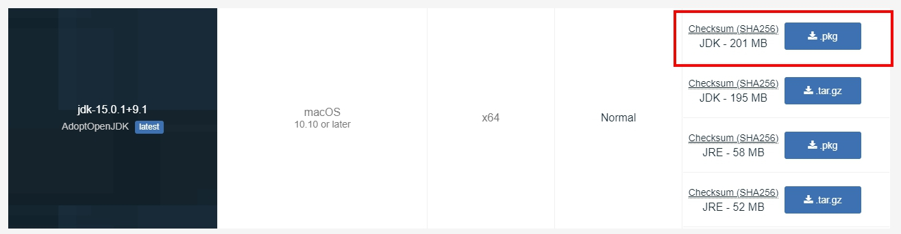
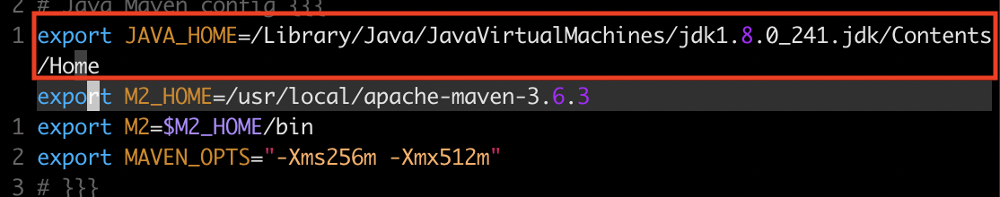
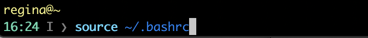
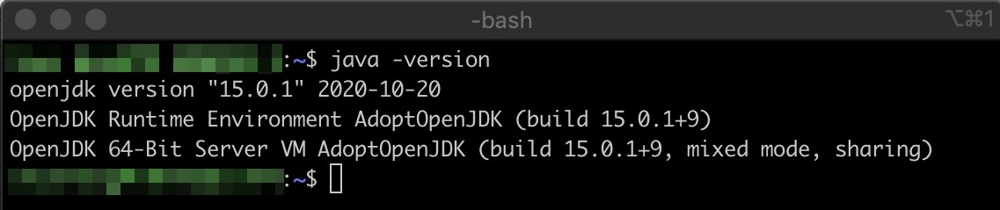
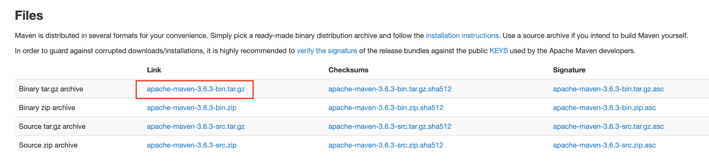
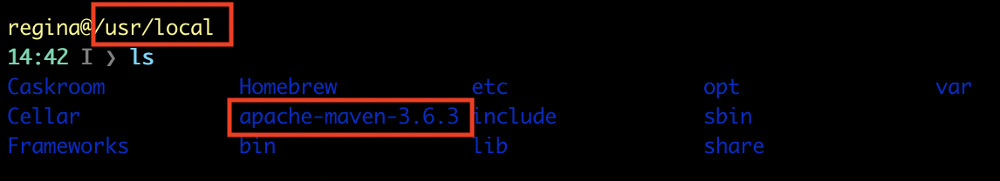
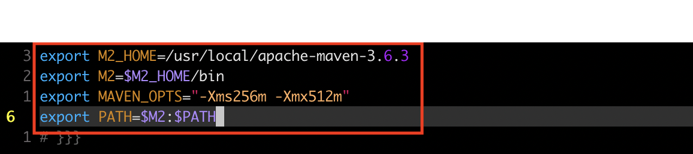
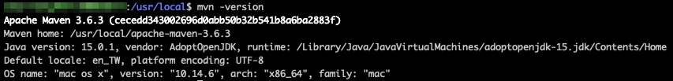

# Environment setting for MacOS

## Step1 Install java
* Install: https://adoptopenjdk.net/releases.html?variant=openjdk15&jvmVariant=hotspot


## Step2 Set java environment
* Edit the following file.(`~/.bashrc`)
```
.bashrc
```

* Set the Environment ```export JAVA_HOME=/Library/Java/JavaVirtualMachines/jdk1.8.0_241.jdk/Contents/Home``` (Add to the file)


* **Open the terminal and enter ```source ~/.bashrc``` to apply the setting**


## Step3 Verify java installation
* Open Terminal and enter the command ```java -version```  
* The result will be the same as below


## Step4 Install Maven
* Install: https://maven.apache.org/download.cgi


## Step5 Extract the Maven Archive
* Put the folder `apache-maven-3.6.3` at the ```/usr/local```


## Step6 Set Maven Environment Variables

* Edit the `.bashrc` file.
* Add the lines to the file
```
export M2_HOME=/usr/local/apache-maven-3.6.3
export M2=$M2_HOME/bin
export MAVEN_OPTS="-Xms256m -Xmx512m"
```
* Add the following line to the `.bashrc` file
```
export PATH=$M2:$PATH
```  


* **Open the terminal and enter ```source ~/.bashrc``` to apply the setting**


## Step7 Verify maven installation
* Open the terminal and enter ```mvn --version```
* The result will be the same as below


## Step8 install Visual Studio Code
* Install: https://code.visualstudio.com/
