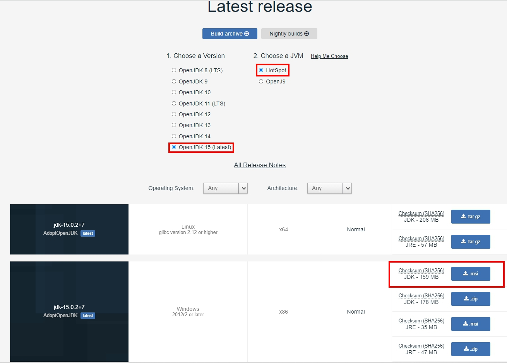
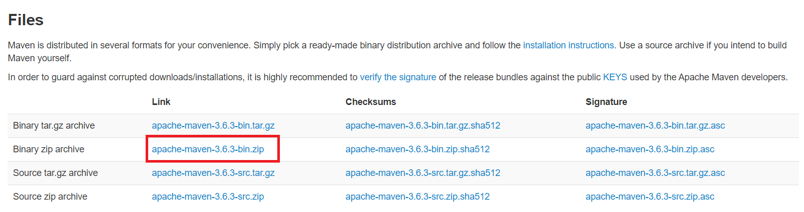

# Environment setting for Windows (Windows 10)

## Step 1: Install Java
* Install java at "AdoptOpenJDK"
* https://adoptopenjdk.net/releases.html?variant=openjdk15&jvmVariant=hotspot
* Version: jdk-15.0.2 +7


## Step 2: Set Java Environment Variables
* Add `JAVA_HOME` to `system variable`.
* `JAVA_HOME`: `C:\Program Files (x86)\AdoptOpenJDK\jdk-15.0.2.7-hotspot`
* Add `%JAVA_HOME%\bin` to `system variable`: `Path`
* **Verify**: cmd `java -version`
* You will see below:
```
openjdk version "15.0.2" 2021-01-19
OpenJDK Runtime Environment AdoptOpenJDK (build 15.0.2+7)
OpenJDK Client VM AdoptOpenJDK (build 15.0.2+7, mixed mode)
```

## Step 3 - Download Maven Archive
* Download `apache-maven-3.6.3-bin.zip`
* https://maven.apache.org/download.cgi
* Version: 3.6.3



## Step 4 - Extract the Maven Archive
* Extract the archive to the directory you wish to install Maven 3.6.3. The subdirectory apache-maven-3.6.3 will be created from the archive.
* Ex. `C:\Program Files\apache-maven-3.6.3`

## Step 5 - Set Maven Environment Variables
* Add M2_HOME, M2, MAVEN_OPTS to `system variable`.
* `M2_HOME`: `C:\Program Files\apache-maven-3.6.3`
* `M2`: `%M2_HOME%\bin`
* `MAVEN_OPTS`: `-Xms256m -Xmx512m`
* Add `%M2%` to `system variable`: `Path`.

## Step 6 - Verify Maven Installation
* **Verify**: cmd `mvn -version`
* You will see below:
```
Apache Maven 3.6.3 (cecedd343002696d0abb50b32b541b8a6ba2883f)
Maven home: C:\Program Files\apache-maven-3.6.3\bin\..
Java version: 15.0.1, vendor: AdoptOpenJDK, runtime: C:\Program Files (x86)\AdoptOpenJDK\jdk-15.0.1.9-hotspot
Default locale: zh_TW, platform encoding: MS950
OS name: "windows 10", version: "10.0", arch: "x86", family: "windows"
```

## Step 7 - Install Visual Studio Code
* Install visual studio code: https://code.visualstudio.com/
