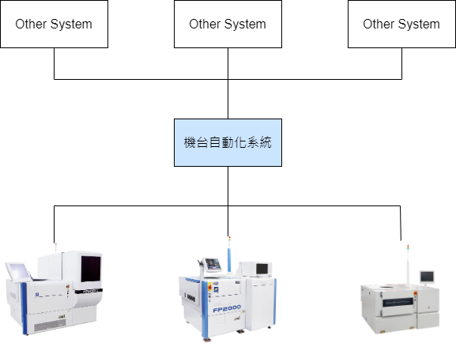
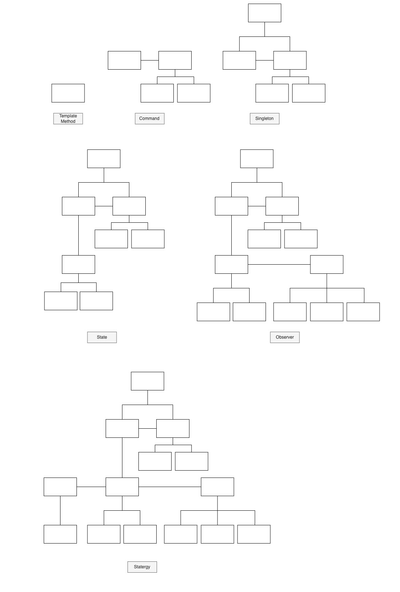

# 機台自動化系統

## Team members

* 112c53028 曾祥語
* 112598084 陳柏勳
* 112598076 劉德劭

## Update List

* 修改 [Template Method Pattern](#template-method-pattern) 的 Class Diagram，將 ```startup()``` 的 ```protected``` 宣告為 ```public```。
* 修改 [Observer Pattern](#observer-pattern) 的 Class Diagram，除標註 Observer Pattern 外，再標註其餘部分為 State Pattern。


## Problem Statement
工廠自動化的意思是藉由整合自動裝置、系統控制、生產設備，來自動化管理生產過程，這牽涉到自動化技術、電腦技術、系統整合、機械手臂設備等條件，才能讓產品達到自動製造，進而提升生產效率與解決人力短缺。然而，想要進行工廠自動化並不簡單，需要仔細的計劃和正確預估自動化工廠成本

隨著工業4.0的革命崛起，工廠都開始陸續轉型，加上大部分年輕人都不太願意待在工廠生產線，因此，勞動力短缺成為製造業目前最大的威脅之一，而工廠自動化被視為解決這一問題的理想方案！除了這個顯著的優勢，在現代製造業中，工廠自動化也帶來了眾多優勢，以下是一些主要優勢：

* 解決人力短缺：自動化系統可以減少對人力的依賴，降低人力成本，還能減少因人為錯誤而引起的生產問題。
* 降低長期成本：工廠自動化系統大多能實現24小時的連續運作，提高生產效率並縮短生產週期。這意味著將時間拉長來看，產能將大於人力，且成本剩下保養、維修機台的花費，無須再支付額外的人事成本。
* 確保品質最佳化：工廠自動化系統可以實時監控生產過程，並透過異常代碼即時反饋生產狀態的信息。這使得大多品質問題都能夠被及時識別和解決，有助於提高產品的一致性和品質。
* 易於系統管理：優化自動化流程有助於簡化系統的管理和操作，再加上實行定期的培訓計劃，可以減少工作人員對系統的學習曲線，降低每一位人員的專業知識落差。



## Class Diagram

### Template Method Pattern

雖然不同的機台行為不同，但在管理時仍然會有相同的行為，因此需要一個 Abstract ```Equipment``` Class 規定所有繼承自```Equipment``` 的 Class 都必須實作的 method，但是一些流程有必要保持一致順序，所以在機台連線時的初始化中加入 Template Method Pattern。

例如，在 ```Equipment``` 啟動與機台連線時，必須先讀取對應類型機台的設定內容，才能向機台送出正確的設定，但因不同機型的設定內容不盡相同，因此保留繼承 Class 可以 Override 這些 Method。


### Command Pattern

Monitor 的主要目的是記住目前正在執行的 Equipment instance，作為管理所有 Equipment 的平台。Monitor 透過 Command 發送指令給 Equipment，可以避免在 Monitor 中實作針對機台的各種操作。
* ```addEquipment()```：建立新的 Equipment 以管理機台。
* ```getEquipmentById()```：取得正在執行的 Equipment instance。
* ```sendActionToEquipment()```：配合```getEquipmentById()```，發送指令給正確的 Equipment instance。

實作 Command
* startup：啟動 Equipment，並執行必要的初始化設定。
* shutdown：關閉 Equipment。


### Singleton Pattern

由於 Monitor 是所有 Equipment 的唯一管理者，因此我們決定將他加上 Singleton Pattern，以確保不會有多個 Monitor instance 同時執行。


### State Pattern

機台自動化管理的重點是為了確保機台有按照正常的流程執行，因此我們使用 State Pattern 控制機台在不同狀態下應該收到什麼訊息、控制程式收到訊息後的反應。

我們實作了最簡單及容易理解的兩個狀態：```Idle``` 及 ```Processing```。
* ```Idle``` 狀態代表機台正在等待生產，此時機台等待足夠的條件達成，諸如收到生產資訊、產品到達機台後，才會進入 ```Processing``` 狀態；
* 進入```Processing``` 狀態後則等待機台生產完畢並收集生產資料，最簡單的例子：計算生產開始與結束時間，協助管理生產週期。


### Observer Pattern

接下來我們為每個 ```State``` 加入 Observer Pattern，讓 ```State``` 判斷訊息合法性後能夠找到負責處理訊息的 ```Observer``` 進行後續處理，並且配合 State Pattern 的特色，每個 ```State``` 需要處理的資訊皆不相同。同時，使用 Observer Pattern 也能夠在 ```State``` 出現新的功能需求時，更輕易地加入新的 ```Observer``` 處理。


### Strategy Pattern

前面是讓機台自動化管理系統能夠運作的主要架構，但是這個系統還需要透過訊息才能夠驅動 ```State``` 檢查訊息合法性，再將訊息傳送給 ```Observer``` 執行對應的操作。

由於不同類型的機台可能使用到不同的傳輸方式，訊息格式也不相同，因此我們決定加入 Strategy Pattern，由不同 Equipment Class 決定自己應該使用的訊息接收發方式。

```MessageHelper``` 負責將最終取得的訊息回傳給 ```Equipment```，```Equipment``` 只需要告訴 ```MessageHelper``` 使用哪一種 ```MessageStrategy``` 即可。

由於這部分只是示範我們能透過訊息驅動系統運作，因此實作 ```MessageStrategy``` 時僅用最簡單的文字檔進行訊息傳遞。


### Summary


### Storyboard



## Sequence Diagram

### Startup

#### System Sequence Diagram


#### Operation Sequence Diagram


### Shutdown

#### System Sequence Diagram


#### Operation Sequence Diagram


### Lot Arrived

#### System Sequence Diagram


#### Operation Sequence Diagram


### Lot Start

#### System Sequence Diagram


#### Operation Sequence Diagram


### Lot End

#### Operation Sequence Diagram


## How to compile

Compile and run using maven:
```
mvn exec:java "-Dexec.mainClass=posd2024f.finalterm"
```
